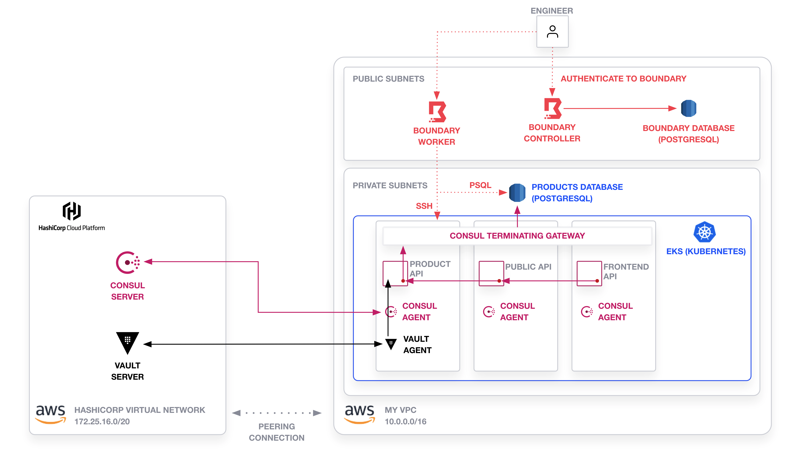
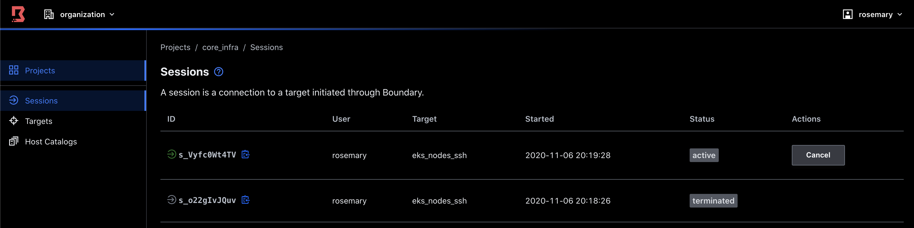

# HashiCorp Demo Application with Boundary, Consul, & Vault on Kubernetes

This is the HashiCorp demo application on Amazon EKS. It incorporates the following
tools:

* Terraform 0.14+
* HCP Consul 1.9.4
* HCP Vault 1.7.0
* Boundary 0.1.5



## Prerequisites

1. Terraform Cloud
1. AWS Account
1. HCP Access, including service principal for automation
1. `jq` installed
1. Install HashiCorp Boundary and an SSH key to `~/projects/boundary`.
   1. Download Boundary to `boundary-deployment/bin/boundary`.
      ```shell
      cd boundary-deployment/bin/boundary
      wget https://releases.hashicorp.com/boundary/${VERSION}/boundary_${VERSION}_linux_amd64.zip -O boundary.zip
      unzip boundary.zip
      rm boundary.zip
      ```
   1. Add an SSH key named `id_rsa` to `boundary-deployment/bin/boundary`.

## Deploy Kubernetes, Boundary, and HCP Clusters

1. Create a Terraform workspace named `infrastructure`
   1. Use the working directory `infrastructure`.
   1. Connect it to VCS Settings.
   1. Variables should include:
      ```
      private_ssh_key (sensitive): base64 encoded SSH Key for Boundary SSH
      database_password (sensitive)
      ```
   1. Environment Variables should include:
      ```
      HCP_CLIENT_ID: HCP service principal ID
      HCP_CLIENT_SECRET (sensitive): HCP service principal secret
      AWS_ACCESS_KEY_ID: AWS access key ID
      AWS_SECRET_ACCESS_KEY (sensitive): AWS secret access key
      AWS_SESSION_TOKEN (sensitive): If applicable, the token for session
      ```

1. Queue to plan and apply. This creates VPCs and networks, an EKS cluster
   with three nodes in a private subnet, an Amazon RDS instance using PostgreSQL,
   a Boundary cluster (load balancer, workers, controllers, and database),
   HCP network with peering to the VPC, and HCP Consul cluster.

1. Go into the HCP Portal. You will need to manually create an **public** HCP Vault
   cluster.

## Configure Boundary

1. Create a Terraform workspace named `boundary-configuration`
   1. Use the working directory `boundary-configuration`.
   1. Connect it to VCS Settings.
   1. Variables should include:
      ```
      tfc_organization: your Terraform Cloud organization name
      tfc_workspace: infrastructure
      ```
      The configuration retrieves a set of variables using `terraform_remote_state`
      data source.
   1. Environment Variables should include:
      ```
      AWS_ACCESS_KEY_ID: AWS access key ID
      AWS_SECRET_ACCESS_KEY (sensitive): AWS secret access key
      AWS_SESSION_TOKEN (sensitive): If applicable, the token for session
      ```

1. Queue to plan and apply. This creates an organization with two scopes:
   - `core_infra`, which allows you to SSH into EKS nodes
   - `product_infra`, which allows you to access the PostgreSQL database

1. Only `product` users will be able to access `product_infra`.
   `operations` users will be able to access both `core_infra`
   and `product_infra`.

1. As an example, you can use the following commands to log in
   first as an operations user and then as a product user.
   ```shell
   make ssh-operations
   ```


## Add Coffee Data to Database

1. To add data, you need to log into the PostgreSQL database.

1. Run the following commands to log in and load data into the `products`
   database.
   ```shell
   make configure-db
   ```

1. If you try to log in as a user of the `products` team, you can print
   out the tables.
   ```shell
   make postgres-products
   ```

1. Go to the Boundary UI and examine the "Sessions".
   


## Configure Consul

1. Create a Terraform workspace named `consul-deployment`
   1. Use the working directory `consul-deployment`.
   1. Connect it to VCS Settings.
   1. Variables should include:
      ```
      tfc_organization: your Terraform Cloud organization name
      tfc_workspace: infrastructure
      ```
      The configuration retrieves a set of variables using `terraform_remote_state`
      data source.
   1. Environment Variables should include:
      ```
      HCP_CLIENT_ID: HCP service principal ID
      HCP_CLIENT_SECRET (sensitive): HCP service principal secret
      AWS_ACCESS_KEY_ID: AWS access key ID
      AWS_SECRET_ACCESS_KEY (sensitive): AWS secret access key
      AWS_SESSION_TOKEN (sensitive): If applicable, the token for session
      ```

1. Queue to plan and apply. This deploys Consul clients and a terminating gateway
   via the Consul Helm chart to the EKS cluster to join the HCP Consul servers.
   It also registers the database as an external service to Consul.

1. Update the [terminating gateway](https://www.consul.io/docs/k8s/connect/terminating-gateways#update-terminating-gateway-acl-token-if-acls-are-enabled) with a
   write policy to the database.
   ```shell
   make kubeconfig
   export CONSUL_HTTP_ADDR=<public HCP Consul address>
   export CONSUL_HTTP_TOKEN=<HCP Consul token>
   make configure-consul
   ``` 

> Note: To delete, you will need to run `make clean-vault` and comment out the `kubernetes.tf` and `consul.tf` files.


## Configure Vault

1. Create a Terraform workspace named `vault-deployment`
   1. Use the working directory `vault-deployment`.
   1. Connect it to VCS Settings.
   1. Variables should include:
      ```
      tfc_organization: your Terraform Cloud organization name
      tfc_workspace: infrastructure
      vault_private_address: Private Address of HCP Vault instance
      ```
      The configuration retrieves a set of variables using `terraform_remote_state`
      data source.
   1. Environment Variables should include:
      ```
      VAULT_ADDR: Public Address of HCP Vault instance
      VAULT_TOKEN (sensitive): HCP Vault root token
      AWS_ACCESS_KEY_ID: AWS access key ID
      AWS_SECRET_ACCESS_KEY (sensitive): AWS secret access key
      AWS_SESSION_TOKEN (sensitive): If applicable, the token for session
      ```

1. This sets up Kubernetes authentication method and PostgreSQL database engine.

> Note: To delete, you will need to run `make clean-vault` and comment out the `kubernetes.tf` and `database.tf` files.


## Deploy Example Application

1. To deploy the example application, run `make configure-application`.

> Note: To delete, you will need to run `make clean-application`.

## Credits

- The module for Boundary is based on the [Boundary AWS Reference Architecture](https://github.com/hashicorp/boundary-reference-architecture/tree/main/deployment)
  with slight modifications.

- The demo application comes from the [HashiCorp Demo Application](https://github.com/hashicorp-demoapp).