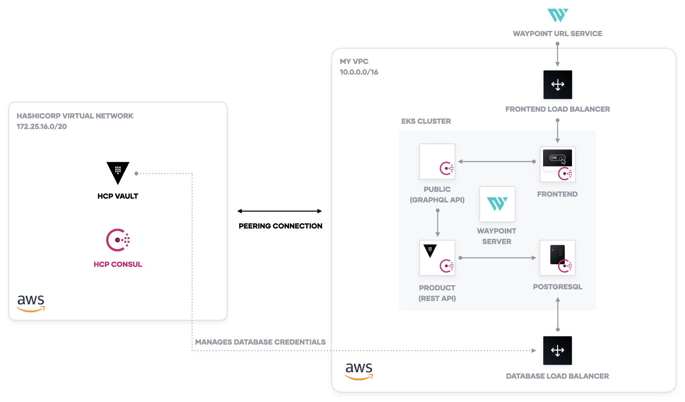

# HashiCorp Demo Application with Boundary, Consul, & Vault on Kubernetes

This is the HashiCorp demo application on Amazon EKS. It incorporates the following
tools:

* Terraform 0.14+
* HCP Consul 1.9.4
* HCP Vault 1.7.0
* Boundary 0.1.5


## Prerequisites

1. Terraform Cloud
1. AWS Account
1. HCP Access, including service principal for automation
1. `jq` installed
1. Install HashiCorp Boundary and an SSH key to `~/projects/boundary`.
   1. Download Boundary to `boundary-deployment/bin/boundary`.
      ```shell
      mkdir -p ~/projects/boundary/bin
      cd ~/projects/boundary/bin
      wget https://releases.hashicorp.com/boundary/0.1.1/boundary_0.1.1_linux_amd64.zip -O boundary.zip
      unzip boundary.zip
      rm boundary.zip
      ```
   1. Add an SSH key named `id_rsa` to `boundary-deployment/bin/boundary`.

## Deploy Kubernetes, Boundary, HCP Network, and HCP Consul

1. Create a Terraform workspace named `infrastructure`
   to use the working directory `infrastructure`. Create
   it using VCS Settings.

1. Add the following variables

1. Set up the peering connection in HVN (do not accept, this configuration will do it for you).

1. In `terraform.tfvars`, set `peering_connection_has_been_added_to_hvn` to true. This executes the HVN/HCP
   module to accept the peering connection and add the security groups for HCP Consul.
   ```hcl
   name                                     = "hcp-demo"
   peering_connection_has_been_added_to_hvn = true
   hcp_vault_private_addr                   = ${HCP_VAULT_PRIVATE_ADDRESS}
   hcp_consul_host                          = ${HCP_CONSUL_PRIVATE_ADDRESS}
   ```

1. Run `make setup` and enter `yes` to configure the HVN peering connection.

1. Run `make configure-consul` to install the Consul Helm chart to your EKS cluster.

1. Run `make configure-vault` to install the Vault Helm chart to your EKS cluster.

1. Run `make configure-waypoint` to install the Waypoint server to your EKS cluster.

1. Run `make configure-boundary` to configure the Boundary deployment.

1. Run `make configure-consul-intentions` to set up Consul intentions and allow traffic
   between services.

## Control & Audit your SSH sessions with Boundary

Using Boundary, you can audit and control the SSH sessions to the Kubernetes nodes.

1. Run `make ssh`. This will authenticate to Boundary and start an SSH session
   with the EKS nodes.

1. Go to the Boundary UI and examine the "Sessions".
   

## Build, Release, & Deploy Applications with Waypoint

The demo application for a coffee shop uses four services: a frontend, a public API,
a products API for a database, and a database.



1. Run `waypoint init` to create the Waypoint project.

1. Run `waypoint up -app database` to create a PostgreSQL database.

1. Run `make configure-db-creds` to configure Vault database secrets engine.

1. Run `waypoint up -app products` to create the products API.

1. Run `waypoint up -app public` to create the public API endpoint.

1. Run `waypoint up -app frontend` to create the demo application frontend. Access
   the URL output by Waypoint.

After you deploy, you will be able to access the deployment URL for the frontend
service and examine a product catalog for the coffee shop.


## Credits

- The module for Boundary is based on the [Boundary AWS Reference Architecture](https://github.com/hashicorp/boundary-reference-architecture/tree/main/deployment)
  with slight modifications.

- The demo application comes from the [HashiCorp Demo Application](https://github.com/hashicorp-demoapp).